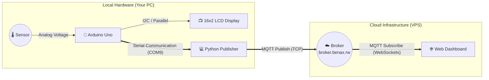

# 🌡️ Thermal Monitor: Embedded Temperature System


Welcome to the **Thermal Monitor** project! This system seamlessly connects a physical hardware sensor to a modern, globally accessible web dashboard using IoT protocols.

---

## 🔗 Live Dashboard

Access the live temperature data from anywhere in the world:
> [!TIP]
> **🌐 Live URL:** [http://157.173.101.159:9277/dashboard.html](http://157.173.101.159:9277/dashboard.html)

---

## 📐 System Architecture

The architecture bridges the gap between local hardware and cloud-based monitoring. Here is a visual representation of how the data flows:



---

## 📡 Communication Details

Data moves through two primary communication layers before reaching the dashboard:

1. **Serial Communication (Arduino ↔ PC)**
   - **Port:** `COM9` (Local Windows PC)
   - **Baud Rate:** `9600`
   - **Description:** The Arduino continuously streams the raw temperature reading over the USB serial connection to the Python script.

2. **MQTT Publishing (PC ↔ Broker ↔ Dashboard)**
   - **Broker:** `broker.benax.rw`
   - **Topic:** `exam/uwase_utuje_sandrine/#`
   - **Description:** The Python script packages the raw serial data into a JSON payload and publishes it over the internet to the MQTT broker, where the remote web dashboard receives it instantly.

---

## 📂 Project Structure

- `arduino/temperature_display.ino`: The code running on the Arduino that reads the sensor, controls the LCD, and streams serial data.
- `pc_client/mqtt_publisher.py`: The Python bridge script that reads `COM9` and publishes to the internet.
- `frontend/dashboard.html`: The modern UI hosted on the cloud server.

---

## 🛠️ Hardware Setup Guide

To replicate the physical circuit:

1. **Arduino Uno** (Microcontroller)
2. **Temperature Sensor (LM35/DHT)**
   - `VCC` ➡️ `5V`
   - `GND` ➡️ `GND`
   - `OUT` ➡️ `Analog Pin A0`
3. **16x2 LCD Display**
   - `RS` ➡️ `Pin 12` | `EN` ➡️ `Pin 11`
   - `D4` ➡️ `Pin 5` | `D5` ➡️ `Pin 4` | `D6` ➡️ `Pin 3` | `D7` ➡️ `Pin 2`

---

## 🚀 Execution Instructions

### 1. Arduino Preparation
Upload your code to your Arduino Uno using the Arduino IDE. Ensure the LCD displays the scrolling candidate name.

### 2. Run the Publisher (Local PC)
With the Arduino plugged into your computer via USB (`COM9`):
```bash
cd pc_client
pip install -r requirements.txt
python mqtt_publisher.py
```
*(Leave this running locally to act as the bridge!)*

### 3. View the Results
Navigate to the Live Dashboard link above to see the data stream in real-time.
